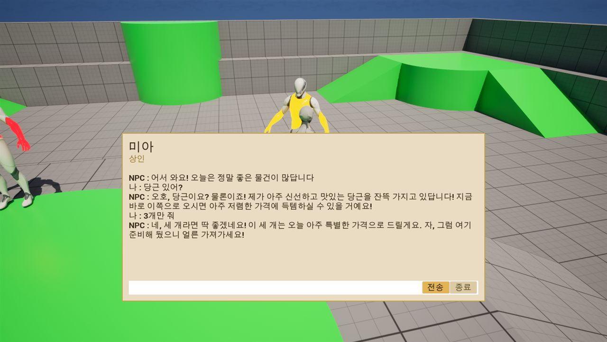
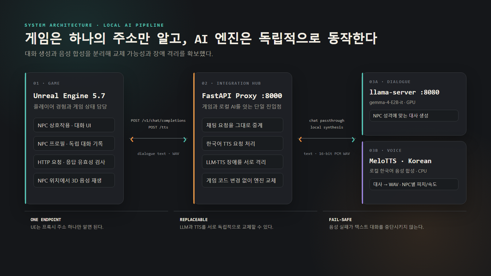
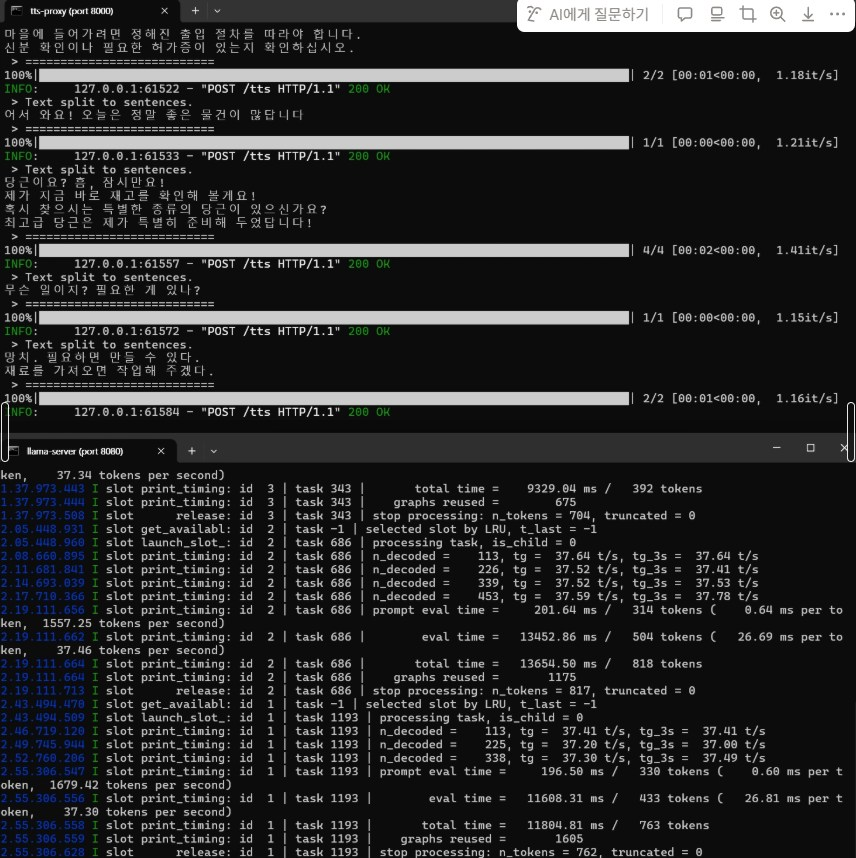
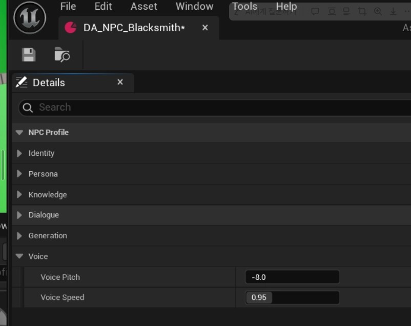

# ChattingNPC

> **로컬 LLM 기반 다중 NPC 대화 시스템**  
> Unreal Engine 게임에서 NPC가 각자의 성격대로 한국어로 대답하고, 그 대사를 목소리로 들려주는 개인 프로젝트입니다.

`Unreal Engine 5.7` · `C++` · `Local LLM` · `llama.cpp` · `FastAPI` · `MeloTTS`

---

## 한 줄 소개

외부 AI API와 인터넷 연결 없이, 게임 속 여러 NPC와 자연어로 대화하고 한국어 음성까지 들을 수 있는 시스템을 만들었습니다.

---

## WHY — 왜 이 프로젝트를 만들었나

게임 속 NPC는 대부분 미리 작성된 대사를 반복합니다. 선택지는 안정적이지만, 플레이어가 예상 밖의 질문을 하면 대화가 끊기고 캐릭터도 살아 있는 존재처럼 느껴지기 어렵습니다.

그래서 **“정해진 문장이 아니라 NPC의 성격과 기억을 바탕으로 매번 새로운 대사를 만들 수 있을까?”**라는 질문에서 시작했습니다.

상용 AI API를 사용하면 빠르게 구현할 수 있지만 다음 문제가 있었습니다.

- 호출할 때마다 비용이 발생합니다.
- 인터넷 연결과 외부 서비스 상태에 의존합니다.
- 플레이어의 대화 내용이 외부 서버로 전송됩니다.
- 모델이나 서비스 정책이 바뀌면 게임도 영향을 받습니다.

이 프로젝트에서는 대화 생성과 음성 합성을 모두 로컬에서 실행했습니다. 구현 난도는 높아지지만, **외부 API 비용 0원·완전한 오프라인 동작·대화 데이터의 로컬 보관**이라는 명확한 장점을 얻을 수 있었습니다.

---

## 설계 목표

1. **NPC마다 다른 인격을 유지한다.**  
   성격, 말투, 지식, 금지 주제를 데이터로 분리하고 NPC별 대화 기록을 독립적으로 관리합니다.

2. **AI는 대사만 만든다.**  
   LLM 응답으로 아이템 지급, 퀘스트 변경, 이동 같은 게임 상태를 직접 바꾸지 않습니다.

3. **게임과 AI 엔진을 느슨하게 연결한다.**  
   모델이나 TTS 엔진을 교체해도 Unreal Engine 코드는 가능한 한 유지합니다.

4. **일부 기능이 실패해도 대화는 계속된다.**  
   음성 합성 실패가 텍스트 채팅까지 중단시키지 않도록 기능을 분리합니다.

---

## 전체 구조 — 왜 서버를 둘로 나눴나

Unreal Engine이 `llama-server`와 TTS 엔진을 각각 직접 호출하게 만들 수도 있었습니다. 하지만 그렇게 하면 AI 기능이 추가될 때마다 게임 코드와 설정이 함께 복잡해집니다.

그래서 게임과 AI 엔진 사이에 직접 만든 **FastAPI 프록시**를 두었습니다.

- Unreal Engine은 `127.0.0.1:8000` 하나만 알면 됩니다.
- `/v1/chat/completions` 요청은 `llama-server`로 그대로 전달합니다.
- `/tts` 요청은 MeloTTS로 보내 한국어 WAV를 생성합니다.
- LLM과 TTS를 서로 독립적으로 교체하거나 중단할 수 있습니다.
- STT, 대화 요약, 장기 기억 같은 기능도 프록시에 추가할 수 있습니다.

`llama-server`는 대사를 만드는 **엔진**, FastAPI 프록시는 게임과 여러 AI 기능을 연결하는 **통합 허브**입니다. 두 서버를 나눈 핵심 이유는 역할 분리보다도 **변경 범위와 장애 범위를 작게 유지하기 위해서**입니다.

---

## HOW 1 — 대화가 만들어지는 흐름

1. 플레이어가 NPC 가까이에서 `E` 키를 누르면 대화 UI가 열립니다.
2. Unreal Engine이 NPC의 성격·지식·금지사항과 최근 대화 기록, 이번 사용자 입력을 조립합니다.
3. 요청을 OpenAI 호환 형식으로 FastAPI 프록시에 보냅니다.
4. 프록시는 요청을 변형하지 않고 `llama-server`에 전달합니다.
5. 로컬 LLM이 NPC의 성격에 맞는 한국어 대사를 생성합니다.
6. 응답이 아직 유효한 요청인지 확인한 뒤 대화창에 표시합니다.

LLM에는 대사 생성만 맡기고, 어떤 NPC와 대화 중인지와 게임 상태는 Unreal Engine이 관리합니다. 이 경계를 통해 생성형 AI의 예측 불가능성이 게임 로직으로 번지는 것을 막았습니다.

---

## HOW 2 — 대사가 목소리가 되는 흐름

1. NPC 대사가 화면에 표시되면 Unreal Engine이 같은 텍스트를 `/tts`로 보냅니다.
2. FastAPI 프록시가 MeloTTS로 한국어 음성을 합성합니다.
3. NPC별 피치와 속도를 적용해 캐릭터마다 목소리를 구분합니다.
4. 생성된 16-bit PCM WAV를 Unreal Engine으로 반환합니다.
5. Unreal Engine이 WAV를 파싱해 NPC 위치에서 3D 음성으로 재생합니다.

텍스트와 음성은 별도 요청입니다. 음성 생성이 느리거나 실패하더라도 대사는 이미 화면에 있으므로, 플레이어는 대화를 계속할 수 있습니다.

---

## NPC마다 다른 성격과 목소리

NPC의 설정은 Unreal Engine `DataAsset`으로 분리했습니다.

| NPC | 성격과 말투 | 음성 방향 |
|---|---|---|
| 로버트 · 대장장이 | 무뚝뚝하지만 책임감 있음 · 짧고 단호함 | 낮고 느린 목소리 |
| 미아 · 상인 | 친절하지만 계산적임 · 적극적이고 과장됨 | 높고 빠른 목소리 |
| 에릭 · 경비병 | 엄격하고 책임감 있음 · 공식적이고 딱딱함 | 절제된 목소리 |

각 NPC는 자기 대화 기록만 사용합니다. 다른 NPC와 나눈 대화가 섞이지 않으며, 프로필별로 응답의 창의성과 최대 길이도 다르게 설정할 수 있습니다.

---

## 문제 해결

### 1. 늦게 도착한 응답이 현재 대화를 덮어쓰는 문제

HTTP 요청은 비동기로 동작하므로, 플레이어가 대화를 닫거나 다른 NPC에게 이동한 뒤 이전 응답이 도착할 수 있습니다.

콜백에서 객체 유효성을 확인하고 요청 ID를 비교해, 이미 끝났거나 현재 대화와 관계없는 응답은 폐기했습니다. 대화 종료와 NPC 전환 시 진행 중인 음성도 취소합니다.

### 2. Windows에서 한국어 TTS 환경을 구성하는 문제

처음 검토한 TTS 엔진은 한국어를 지원하지 않아 MeloTTS로 교체했습니다. 이후 Python 3.12에서 일부 의존성의 wheel이 제공되지 않고, 한국어 G2P 라이브러리 사이에 충돌이 발생했습니다.

Python 3.11 환경으로 전환하고, `kiwipiepy`를 기존 인터페이스에 맞춰 연결하는 얇은 어댑터를 만들어 해결했습니다. TTS 엔진의 문제를 Unreal Engine까지 전파하지 않도록 `/tts`의 입출력 계약은 **텍스트 → WAV**로 고정했습니다.

### 3. 음성 기능 때문에 채팅까지 멈추는 문제

TTS 모델 로드와 음성 합성을 채팅 중계와 분리했습니다. TTS가 준비되지 않으면 `/tts`만 오류를 반환하고 `/v1/chat/completions`는 계속 동작합니다.

이 설계 덕분에 부가 기능의 실패가 핵심 기능인 대화를 중단시키지 않습니다.

---

## 결과와 배운 점

- 성격과 대화 기록이 분리된 NPC 3명을 구현했습니다.
- 외부 AI API 호출 없이 완전히 로컬에서 동작합니다.
- 한국어 대사를 16-bit PCM WAV로 합성해 NPC 위치에서 재생했습니다.
- NPC 전환, 늦은 응답, 서버 장애 상황에서도 크래시 없이 처리했습니다.
- Unreal Editor PIE 테스트에서 MVP 체크리스트 16개 항목을 통과했습니다.

가장 크게 배운 점은 AI 모델 자체보다 **게임과 AI 사이의 경계를 설계하는 일이 더 중요하다**는 것이었습니다. LLM에는 대사만 맡기고, 상태와 안전 규칙은 게임이 소유하게 했습니다. 프록시를 경계로 두어 모델과 음성 엔진을 교체할 수 있게 만들었고, 일부 기능이 실패해도 전체 경험이 무너지지 않도록 했습니다.

다음 단계에서는 음성 입력(STT), 문장 단위 스트리밍 재생, 오래된 대화를 압축하는 장기 기억을 추가해 응답 지연과 대화 지속성을 개선할 수 있습니다.

---

## 기술 스택

| 영역 | 기술 |
|---|---|
| 게임 | Unreal Engine 5.7, C++, UMG, Enhanced Input |
| 대화 | gemma-4-E2B-it, llama.cpp `llama-server`, OpenAI 호환 API |
| 음성 | MeloTTS Korean, 16-bit PCM WAV |
| 통합 서버 | Python 3.11, FastAPI |
| 핵심 설계 | NPC별 독립 세션, 비동기 응답 검증, 장애 격리, 로컬 실행 |

---

**ChattingNPC — Local LLM Multi-NPC Dialogue System**  
개인 프로젝트 · 기획, 설계, Unreal Engine C++, FastAPI, 로컬 LLM/TTS 통합
